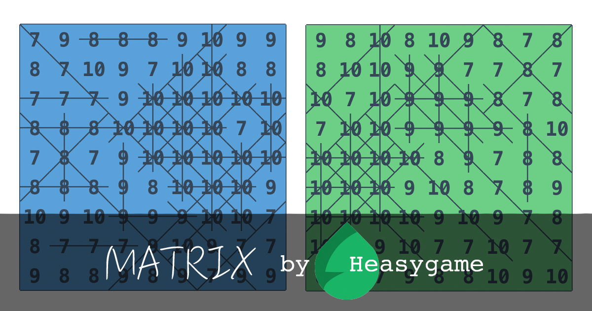

# The game
Matrix by Heasygame

https://matrix.heasygame.com/




# Program

- Language: JavaScript
- Dependencies: none
- Basic structure:
    ```javascript
    class Game {
    }

    class GameAI {
    }

    var game = new Game();
    var gameAI = new GameAI(game);

    var channel = require('js/game.js').default.channel;
    channel.onMessage = function(e, t, n) {
      if (e === 'game:new_piece') {
        var position = gameAI.getPosition(t.piece);
        setTimeout(function() {
          channel.push('game:place_piece', {
            x: position.c, // column
            y: position.r  // row
          });
        }, 500);
      }
      return t;
    }
    ```

- How to use:
    - Join a game
    - Copy & paste code into developer console and run it
    - Click on `READY`, the AI will then play the game.

# Game AIs

## RandomAI

The dummiest "AI". It just places pieces randomly.

```javascript
class GameAI {
  constructor(game) {
    this.game = game;
  }

  getPosition(piece) {
    var position = this.game.emptyPositions.sample();

    this.game.placePiece(piece, position);

    return position;
  }
}
```


## GreedyAI

Places a new piece at the position that results in largest score.

```javascript
class GameAI {
  constructor(game) {
    this.game = game;
  }

  getFirstPosition(piece) {
    // heuristic stuffs
    // ...
  }

  getBestPosition(piece) {
    var positions = this.game.emptyPositions;
    var bestPosition = positions[0];
    var maxScore = 0;

    for (var i = 0; i < positions.length; i++) {
      var position = positions[i];
      var score = game.tryGetScore(piece, position);
      if (score > maxScore) {
        maxScore = score;
        bestPosition = position;
      }
    }

    return bestPosition;
  }

  getPosition(piece) {
    var position;

    if (this.game.turn === 0) {
      position = this.getFirstPosition(piece);
    }
    else {
      position = this.getBestPosition(piece);
    }

    this.game.placePiece(piece, position);

    return position;
  }
}
```


## AlphaBetaAI

Tries to maximize the score even if next pieces are worst. It uses [Alpha-beta pruning](https://en.wikipedia.org/wiki/Alpha%E2%80%93beta_pruning) with move ordering to search for the optimal position to place a new piece.

```javascript
class GameAI { // AlphaBetaAI
  constructor(game) {
    this.game = game;
    this.alphaBeta = new AlphaBeta();
  }

  getFirstPosition(piece) {
    // heuristic stuffs
    // ...
  }

  getRandomPosition() {
    return this.game.emptyPositions.sample();
  }

  searchPosition(piece) {
    if (this.game.turn >= 15) {
      this.alphaBeta.maxDepth = 9;
      this.alphaBeta.maxMoveBreadth = 5;
      this.alphaBeta.minMoveBreadth = 2;
    }
    else if (this.game.turn >= 10) {
      this.alphaBeta.maxDepth = 9;
      this.alphaBeta.maxMoveBreadth = 6;
      this.alphaBeta.minMoveBreadth = 2;
    }
    else if (this.game.turn >= 5) {
      this.alphaBeta.maxDepth = 5;
      this.alphaBeta.maxMoveBreadth = 27;
      this.alphaBeta.minMoveBreadth = 64;
    }

    return this.alphaBeta.search(this.game, piece).position || this.getRandomPosition();
  }

  getPosition(piece) {
    var position;

    if (this.game.turn === 0) {
      position = this.getFirstPosition(piece);
    }
    else {
      position = this.searchPosition(piece);
    }

    this.game.placePiece(piece, position);

    return position;
  }
}
```

Implementation notes:

- Max player is the AI while min player is the Matrix game. Let's think that the game tries to minimize the score by providing pieces that are as bad as possible.
- Search depth and branching factor change dynamically based on the number of pieces provided so far.

## MonteCarloAI

Uses [Monte Carlo simulation](https://en.wikipedia.org/wiki/Stochastic_simulation#Monte_Carlo_simulation) to estimate the "value" of each position: it places the new piece into that position then simulates a number of random games from that state. The total score of those games is used as the value of that position. Finally, it returns the position with highest value.


```javascript
class GameAI { // MonteCarloAI
  constructor(game) {
    this.game = game;
    this.alphaBeta = new AlphaBeta();
    this.gameSimulator = new GameSimulator();
  }

  getFirstPosition(piece) {
    // heuristic stuffs
    // ...
  }

  getRandomPosition() {
    return this.game.emptyPositions.sample();
  }

  searchPosition(piece) {
    var positions = this.game.emptyPositions;
    var bestPosition;
    var bestScore = 0;
    var oldScore = this.game.score;

    for (var i = 0; i < positions.length; i++) {
      var position = positions[i];
      var g = this.game.clone();
      g.placePiece(piece, position);

      if (g.score <= oldScore) continue;

      var score = 0;
      for (var j = 0; j < 50 + (this.game.turn - 5) * 5; j++) {
        score += this.gameSimulator.simulate(g.clone()).getRealScore();
      }

      if (score > bestScore) {
        bestScore = score;
        bestPosition = position;
      }
    }

    return bestPosition || positions.sample();
  }

  getPosition(piece) {
    var position;
    if (this.game.turn === 0) {
      position = this.getFirstPosition(piece);
    }
    else if (this.game.turn < 5) {
      position = this.alphaBeta.search(this.game, piece).position || this.getRandomPosition();
    }
    else {
      position = this.searchPosition(piece);
    }
    this.game.placePiece(piece, position);

    return position;
  }
}
```

Implementation notes:
- Use AlphaBeta search for some first pieces.
- The number of simulations changes dynamically based on the number of pieces provided so far.
